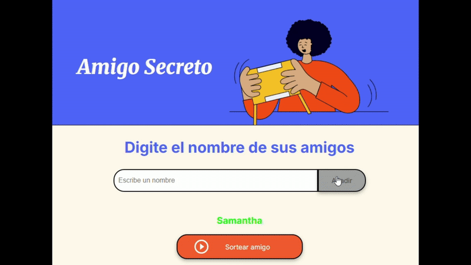

# Primer chalenge - Amigo secreto

## Descripción de proyecto

Después de completar los aprendizajes de lógica de programación, se propone el presente challenge para aplicar los conocimientos obtenidos.

>*Antes de continuar, te invito a visitar la página dando click [aquí].*

Los aspectos que debe cumplir son los siguientes:

>* Agregar nombres: Los usuarios escribirán el nombre de un amigo en un campo de texto y lo agregarán a una lista visible al hacer clic en "Adicionar". 
>> * Declarar una variable de tipo array para guardar los nombres ingresados `let amigos = []`
>* Validar entrada: Si el campo de texto está vacío, el programa mostrará una alerta pidiendo un nombre válido.
>>* Implementando una función para obtener el valor del usuario, verificar que sea un dato valido, guardarlo en la variable `amigos` y Limpiar la caja del input.
>* Visualizar la lista: Los nombres ingresados aparecerán en una lista debajo del campo de entrada.
>>* Implementar una función que agregue todos los elementos del array en una lista que se postrará en la pantalla con ayuda de la estructura `for`
>* Sorteo aleatorio: Al hacer clic en el botón "Sortear Amigo", se seleccionará aleatoriamente un nombre de la lista y se mostrará en la página.
>>* Generar una función que seleccione aleatoriamente un nombre de los guardados en el array `amigos` siempre y cuando haya al menos 2 elementos, posteriormente, borrar la lista completa y mostrar el nombre resultante en pantalla.

De la programación inicial propuesta se añadieron las siguientes funcionalidades:

>* La verificación del input marcaba que no fuera un valor vacío (`''`), se mejoro al revisar que el dato ingresado no cuente con números o carácteres especiales.
>* Se ha procurado que el cursor se dirija en todo momento a la caja del input para facilidad del usuario.
>* Cuando se desee volver a sortear un amigo, basta con ingresar un nuevo nombre para que se resetee la página.

## Demostración de funciones y aplicaciones

A continuación se ilustra la forma de uso del programa, la comprobación del correcto funcionamiento de las comprobaciones programadas y la correcta ejecución del programa.

[aquí]: <https://luisleonla.github.io/challenge-amigo-secreto_esp-main/>
